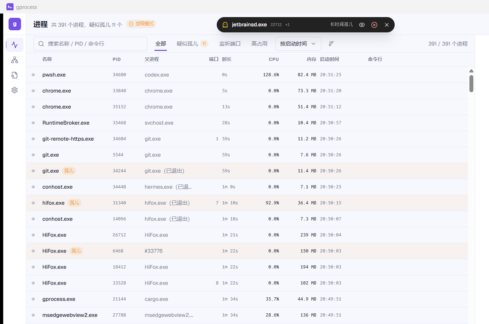
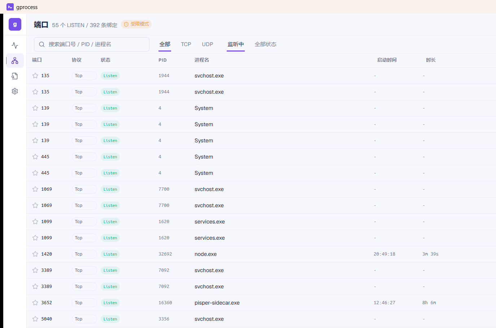
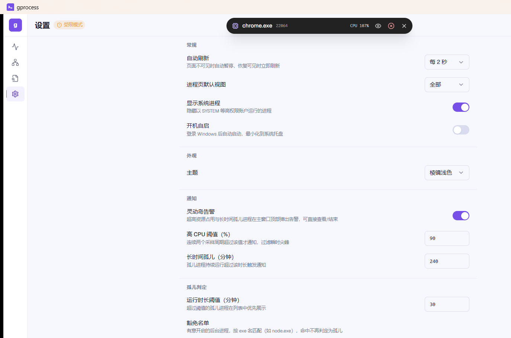

# gprocess

<p align="center">
  
  
  
  
  
  
  
</p>

<p align="center">
  简体中文 · <a href="README.md">English</a>
</p>

一款面向开发机的轻量级 Windows 进程与端口管理桌面应用。gprocess 用于发现被遗忘的进程、被占用的端口和被锁定的文件，评估结束进程的风险，并安全地完成清理。

项目基于 Tauri 2、React 19、TypeScript 和 Rust 构建。

<p align="center">
  
</p>

## 界面预览

<table>
  <tr>
    <td width="50%" align="center">
      <br>
      <sub>查看 TCP/UDP 绑定与监听端口</sub>
    </td>
    <td width="50%" align="center">
      <br>
      <sub>配置监控、告警、开机自启和外观</sub>
    </td>
  </tr>
</table>

## 功能特性

- **进程总览**：查看 CPU、内存、启动时间和运行时长，支持筛选、排序与虚拟滚动。
- **孤儿进程判定**：识别父进程退出与 PID 复用，并将系统路径、Windows 服务、开机启动项和已知启动器识别为正常来源。
- **端口占用检查**：查看 TCP/UDP 绑定、筛选监听端口、置顶关注端口，并跳转到对应进程。
- **文件占用查找**：通过 Windows Restart Manager API 查找锁定指定文件的进程。
- **安全结束评估**：使用四级风险分类，结束前展示子进程和占用端口，并支持结束整个进程树。
- **应用内告警**：通过紧凑的灵动岛样式通知展示持续高 CPU 与长时间孤儿进程告警。
- **桌面集成**：支持系统托盘、近 60 秒资源曲线、开机自启与 GitHub Releases 自动更新。
- **管理员提权**：识别权限受限状态，并在需要时以管理员身份重新启动。

## 环境要求

- Windows 10 或 Windows 11
- Node.js 18 或更高版本
- npm
- Rust stable，安装 `x86_64-pc-windows-msvc` target
- Visual Studio Build Tools，包含 MSVC 工具链
- WebView2 Runtime

## 本地开发

```powershell
npm install
npm run tauri dev
```

仅调试前端界面、不连接原生进程数据时：

```powershell
npm run dev
```

## 质量验证

```powershell
npm run build

Push-Location src-tauri
cargo test
cargo clippy -- -D warnings
Pop-Location
```

## 生产构建

构建独立可执行文件时，需要启用 Tauri 生产协议：

```powershell
Push-Location src-tauri
cargo build --release --features custom-protocol
Pop-Location
```

可执行文件输出到 `src-tauri/target/release/gprocess.exe`。

准备好 NSIS/WiX 工具链后，可构建 Windows 安装包：

```powershell
npm run tauri build -- --bundles nsis,msi
```

安装包构建、签名和 GitHub Releases 自动更新流程见 [docs/build.md](docs/build.md)。

## 项目结构

```text
src/                    React 前端
src/components/         应用组件与通用 UI 组件
src/hooks/              快照与告警状态 Hooks
src/pages/              进程、端口、句柄和设置页面
src-tauri/src/          Rust 命令与 Windows 系统集成
docs/                   产品、架构、里程碑和构建文档
```

## 项目文档

- [产品与设计规格](docs/design-spec.md)
- [项目总体计划](docs/plans.md)
- [构建与发版指南](docs/build.md)
- [里程碑文档](docs/plan)
- [工程协作规范](AGENTS.md)

## 许可证

本项目暂未授予开源许可证。未经所有者明确授权，不得复制、修改或分发源代码。
